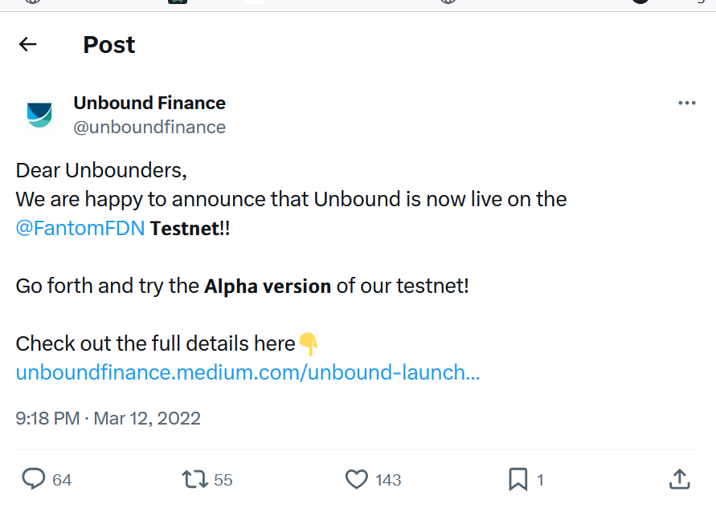

# Unbound Finance 

# Description
Unbound Finance is a novel, non-custodial lending platform, driven towards enabling newer and better opportunities of yield with a view to improving the overall capital efficiency of the DeFi ecosystem. Through synthetic assets like UND stablecoin, Unbound aims to unlock the liquidity available in DeFi DEXs and to enable the easy flow of this liquidity from one chain to another without actually removing it.

## The key highlights of protocol are as follows :

Interest-free borrowing: Unbound does not charge any interest on the borrowed UND.
Perpetual borrowing: At Unbound, borrowers have unlimited maturities. Users can unlock the underlying collateral any time by simply paying off the outstanding debt.
Stablecoin UND: UND is the first flagship product of the Unbound protocol. It is a decentralized, cross-chain stablecoin designed to be native to the AMM space.
Factory Smart Contracts: Unbound makes use of liquidity lock contracts that are permissionless and support EVM-based AMMs like Uniswap, Balancer, Curve, SushiSwap and the like.
Collateralizing concentrated liquidity positions: Unbound is one of the first protocols that allows concentrated liquidity positions to be used as collateral for borrowing synthetic crypto assets such as UND stablecoin.

### Unbound finance Whitepaper
🔗 [View whitepaper](https://wiki.unbound.finance/)

## Unbound Finance Roadmap

## 2020
- **March 2020** - Research and ideation for Unbound begins.
- **April 2020** - First draft of the whitepaper is released.
- **May 2020** - Development of proof of concept kicks off.
- **June 2020** - Protocol is pitched to OGS for feedback.
- **August 2020** - Official registration of the Unbound Finance domain name.
- **December 2020** - Release of the inaugural official whitepaper.

## 2021
- **February 2021** - Unbound releases its application and landing page.
- **April 14th, 2021** - Unbound launches Zeta Testnet.
- **June 10th, 2021** - Unbound Finance closes its first round of investment.
- **August 19th, 2021** - Unbound unveils its initial official Roadmap.
- **September 2nd, 2021** - Unbound partners with Harmony.
- **September 28th, 2021** - Unbound Sandbox live on Ethereum Mainnet.
- **November 4th, 2021** - Unbound goes live on Ethereum mainnet.
- **November 5th, 2021** - Unbound partners with Kyber Network.
- **November 18th, 2021** - Unbound partners with Avalanche.
- **December 18th, 2021** - Unbound partners with Avalanche.
- **December 17th, 2021** - UNB listing available on MEXC.
- **December 20th, 2021** - UNB listing available on Gate.io.

## 2022
- **January 24th, 2022** - Unbound on-chain staking live on Ethereum and BSC.
- **March 2nd, 2022** - Unbound goes live on Polygon mainnet.
- **March 3rd, 2022** - Unbound partners with Quickswap.
- **March 12th, 2022** - Unbound launches on Fantom testnet Alpha version.
- **May 15th, 2022** - Unbound goes live on BSC mainnet.
- **May 15th, 2022** - $UNB on-chain staking live on Polygon.
- **May 25th, 2022** - Unbound partners with DFYN.
- **May 31st, 2022** - Unbound live on BNB chain.
- **June 2nd, 2022** - UND-USDC pool live on Kyberswap.
- **June 14th, 2022** - $UNB flexible staking live on Kucoin.
- **June 25th, 2022** - Unbound partners with Pangolin.
- **August 1st, 2022** - Unbound partners with Router Protocol.
- **August 7th, 2022** - Unbound partners with Multichain.
- **September 14th, 2022** - Unbound live on Fantom mainnet.
- **October 20th, 2022** - Unbound V2 public testnet live.
- **November 28th, 2022** - Unbound live on Lens protocol.
- **November 13th, 2022** - Unbound V2 testnet phase 2 live.
- **December 21st, 2022** - Unbound partners with DeFiEdge.

## 2023
- **January 8th, 2023** - Unbound V2 Second Security Audit completed.
- **March 25th, 2023** - UNB ready and live for trading on Changelly.
- **April 5th, 2023** - Unbound partners with Changelly.
- **April 11th, 2023** - Unbound V2 live on Arbitrum mainnet.
- **October 16th, 2023** - Unbound partners with Arbidex.
- **December 7th, 2023** - UNB transfers into an OFT through integration with LayerZero.
- **December 21st, 2023** - UNB bridging live on Stargate Finance.

## 2024
- **February 2024** - Unbound server launched on Discord.
- **April 2024** - Website and application revamped for an enhanced user experience.
- **May 14th, 2024** - Unbound DAO live.
- **July 27th, 2024** - $UNB bridging to Arbitrum chain live via the Stargate bridge.
- **September 24th, 2024** - Enabling Multichain Voting for UNB Holders in Unbound DAO Governance.

## 🔗 Key Announcements

### Unbound launches Zeta Testnet
🔗 [View Tweet](https://x.com/unboundfinance/status/1382276993316573185)

### Sandbox mainnet live on Ethereum
🔗 [View Tweet](https://x.com/unboundfinance/status/1442555884954030081)

### UNB flexible promotion live
🔗 [View Tweet](https://x.com/unboundfinance/status/1536276972900618240)

### Unbound partners with Kyber Network
🔗 [View Tweet](https://x.com/unboundfinance/status/1457614881566302210)

### Unbound live on Avalanche mainnet
🔗 [View Tweet](https://x.com/unboundfinance/status/1552608999077740544)

### UNB deposits and withdrawals available on MEXC
🔗 [View Tweet](https://x.com/unboundfinance/status/1471802223441027072)

### Unbound goes live on Polygon mainnet
🔗 [View Tweet](https://x.com/unboundfinance/status/1493088991045840896)

### Unbound debuts the first-ever Cross-Chain stablecoin UND on Polygon
🔗 [View Tweet](https://x.com/unboundfinance/status/1427291657553145861)

### Unbound partners with Quickswap
🔗 [View Tweet](https://x.com/unboundfinance/status/1494319037354246146)

### Unbound launches on Fantom testnet Alpha version
🔗 [View Tweet](https://x.com/unboundfinance/status/1502672889040224257)

### Unbound goes live on BSC mainnet
🔗 [View Tweet](https://x.com/unboundfinance/status/1517083150111080448)

### Unbound partners with Pangolin
🔗 [View Tweet](https://x.com/unboundfinance/status/1552238085009965056)

### Unbound partners with Router Protocol
🔗 [View Tweet](https://x.com/routerprotocol/status/1581991668496334854)

### Unbound partners with Multichain
🔗 [View Tweet](https://x.com/unboundfinance/status/1567385109871067136)

### Unbound live on Fantom mainnet
🔗 [View Tweet](https://x.com/unboundfinance/status/1569301272326733825)

### Unbound V2 testnet phase 2 live
🔗 [View Tweet](https://x.com/unboundfinance/status/1580225524315848704)

### Unbound V2 releases its application and landing page
🔗 [View Tweet](https://x.com/unboundfinance/status/1776211603488162195)

### UNB ready and live for trading on Changelly
🔗 [View Tweet](https://x.com/unboundfinance/status/1643653712051687424)

### Unbound V2 live on Arbitrum mainnet
🔗 [View Tweet](https://x.com/unboundfinance/status/1645771111127461895)

### UNB bridging to Arbitrum chain live via the Stargate bridge
🔗 [View Tweet](https://x.com/unboundfinance/status/1732689026627293225)

### Unbound DAO live
🔗 [View Tweet](https://x.com/unboundfinance/status/1790354780507759093)

# Media Coverage

https://www.coindesk.com/tech/2023/04/03/unbound-finance-will-soon-allow-stablecoin-borrowing-against-uniswap-lp-positions-on-arbitrum

https://www.prnewswire.com/news-releases/huobi-primelist-to-list-unb-backing-unbound-finances-aims-to-improve-liquidity-for-decentralized-exchanges-301439774.html

© Unbound Finance 2025
